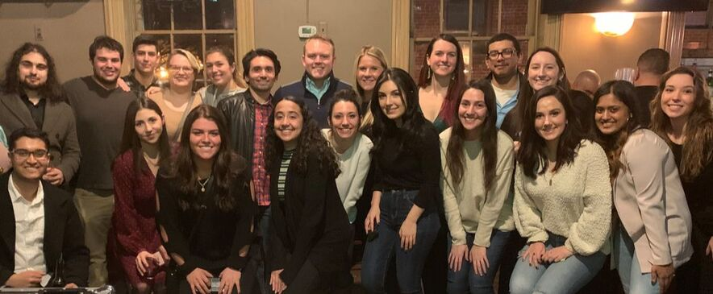

```{r setup, include=FALSE}
knitr::opts_chunk$set(message=FALSE,warning=FALSE, cache=TRUE)
```



Eagle I.O is proud to offer a Mentor Program for students in their first year of Montclair State University's I/O Psychology graduate program. Incoming students are matched with a second-year mentor who can provide extracurricular support and share first-hand knowledge about the I/O profession.

# Mission Statement
Our mentor program is dedicated to creating an environment that fosters growth, development and engagement of first year I/O students to become successful academically, professionally, and socially during graduate school.

## What are the benefits to taking part in the Mentorship Program?
Mentees gain valuable experience by forging one-on-one relationships with seasoned I/O students. These experiences include: helping set realistic goals, strengthening knowledge of the industry/organizational culture/job functions, enhancing overall professional effectiveness, and gaining insight on how to be a future mentor.

Contributing time and expertise as a mentor is a valuable way to give back and foster the next generation of MSU I/O Psych graduate students. Mentoring can be both personally and professionally rewarding as mentors learn the value in helping their peers succeed. These rewards include building leadership skills and communication skills, expanding their professional network and increased visibility, and contributing to the advancement of the profession.

# The Alumni Mentorship Program
Due to the overwhelming success of the mentorship program, we recently made the decision to expand our program to include Alumni! This new facet of the mentorship program designates interested alumni to act as mentors for students in their final year of the I/O Psych program at MSU.

There are many benefits for the alumni mentors and the student mentees. By connecting with an alumni mentor, the student mentees are given a great opportunity to widen their social network and learn more about their desired job roles within the field of I/O by someone with firsthand experience. For the alumni that participate in this program, they have the chance to reconnect with their past professors, receive invites to special events, and gain experience on mentoring a student that is just starting out in the field.
