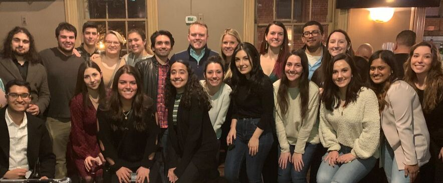

# Current Projects 


```{r Date, warning=FALSE, echo=FALSE, message=FALSE}

## created below code so we don't have to manually update year and date

date <- as.character(Sys.Date())
year <- as.numeric(substring(date,1,4))
month <- substring(date,6,7)

month[month == "01"] <- "Winter"
month[month == "02"] <- "Winter"
month[month == "03"] <- "Spring"
month[month == "04"] <- "Spring"
month[month == "05"] <- "Spring"
month[month == "06"] <- "Summer"
month[month == "07"] <- "Summer"
month[month == "08"] <- "Summer"
month[month == "09"] <- "Fall"
month[month == "10"] <- "Fall"
month[month == "11"] <- "Fall"
month[month == "12"] <- "Winter"

```

As of `r month` `r year`, the primary Eagle I.O projects for the MSU client include a mentorship program and an engagement survey. External projects rotate on an as-needed basis.

## Internal (MSU) Client projects `r emo::ji("building_construction")` {.tabset .tabset-pills}

### Mentorship

```{r setup, include=FALSE}
knitr::opts_chunk$set(message=FALSE,warning=FALSE, cache=TRUE)
```



Eagle I.O is proud to offer a Mentor Program for students in their first year of Montclair State University's I/O Psychology graduate program. Incoming students are matched with a second-year mentor who can provide extracurricular support and share first-hand knowledge about the I/O profession.

#### Mission Statement
Our mentor program is dedicated to creating an environment that fosters growth, development and engagement of first year I/O students to become successful academically, professionally, and socially during graduate school.

##### What are the benefits to taking part in the Mentorship Program?
Mentees gain valuable experience by forging one-on-one relationships with seasoned I/O students. These experiences include: helping set realistic goals, strengthening knowledge of the industry/organizational culture/job functions, enhancing overall professional effectiveness, and gaining insight on how to be a future mentor.

Contributing time and expertise as a mentor is a valuable way to give back and foster the next generation of MSU I/O Psych graduate students. Mentoring can be both personally and professionally rewarding as mentors learn the value in helping their peers succeed. These rewards include building leadership skills and communication skills, expanding their professional network and increased visibility, and contributing to the advancement of the profession.

#### The Alumni Mentorship Program
Due to the overwhelming success of the mentorship program, we recently made the decision to expand our program to include Alumni! This new facet of the mentorship program designates interested alumni to act as mentors for students in their final year of the I/O Psych program at MSU.

There are many benefits for the alumni mentors and the student mentees. By connecting with an alumni mentor, the student mentees are given a great opportunity to widen their social network and learn more about their desired job roles within the field of I/O by someone with firsthand experience. For the alumni that participate in this program, they have the chance to reconnect with their past professors, receive invites to special events, and gain experience on mentoring a student that is just starting out in the field.

### Engagement


The purpose of the Comprehensive Workplace Engagement Assessment (CWEA) is to establish current levels of engagement and productivity at a given company as well as identify areas that are negatively affecting these engagement and productivity levels. Through identification of these areas, Eagle I.O consultants can provide the necessary tools to increase these levels and improve the workplace culture at any company. 

The engagement product will aggregate two scales: **Absorption**, **Vigor**, & **Enthusiasm** and **Cognition**, **Affect**, & **Behavior**. When fully launched, the intent will be to perform academic analyses, such as construct validation, and to collect norms. The process is documented within the [Technical Report](https://bookdown.org/kulasj/engagetech/), which includes the: (1) construction and initial findings, (2) user manual and norms description, (3) feedback report, and (4) localized validation studies. 

## External `r emo::ji("briefcase")`{.tabset .tabset-pills}

### Client 1

<center>

</center>

We are currently in the pilot phase to address the lack of industry-specific digital metrics for asset management. In a comprehensive report, we will be creating contextual benchmarks and performing predictive analytics on email metrics for asset managers. 

### Client 2

<center>

</center>  

We are helping evaluate the effectiveness of a leadership development training program. We are summarizing reaction data, facilitating focus groups, and developing a standardized evaluation system to be implemented in the future.

### Client 3

<center>

</center>  

We have partnered with gothamCulture and Spring Point to create a technical report for their culture assessment pilot. This report will detail the relevant literature, initial psychometric properties, and suggested future directions.

### Client 4

<center>

</center>  

We are helping develop and validate a broad personality inventory intended to be used in a selection context. Additionally, we are helping develop a feedback report and the R-script automating the generation of the feedback report.


