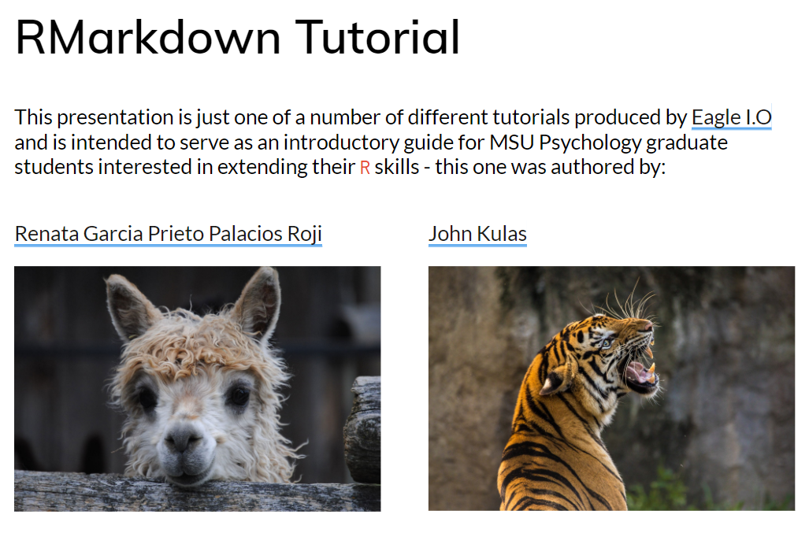
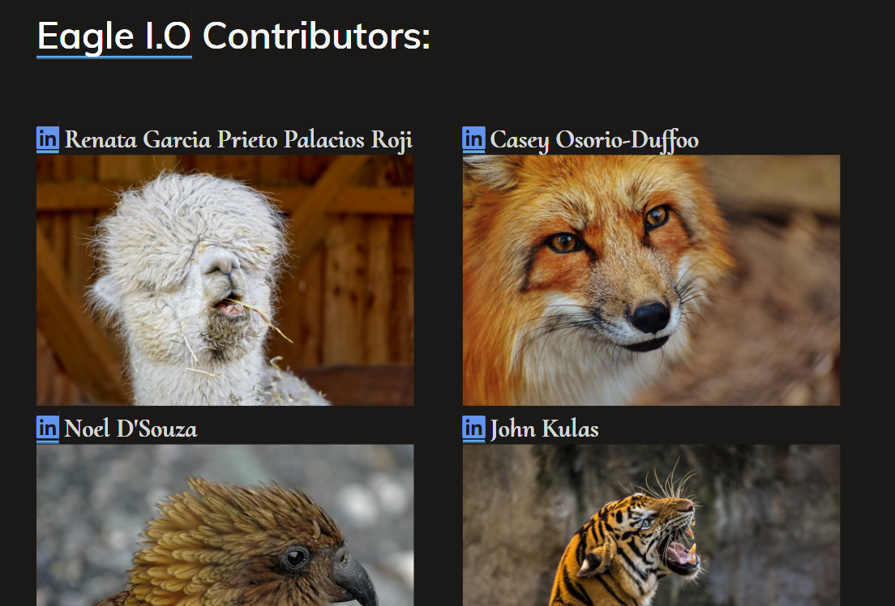
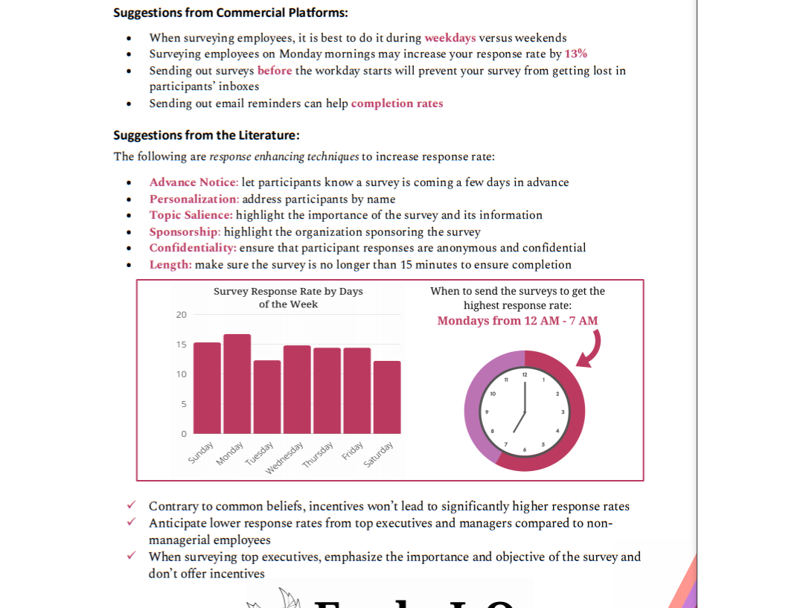

# Resources

```{r Date, warning=FALSE, echo=FALSE, message=FALSE}

## created below code so we don't have to manually update year and date

date <- as.character(Sys.Date())
year <- as.numeric(substring(date,1,4))
month <- substring(date,6,7)

month[month == "01"] <- "Winter"
month[month == "02"] <- "Winter"
month[month == "03"] <- "Spring"
month[month == "04"] <- "Spring"
month[month == "05"] <- "Spring"
month[month == "06"] <- "Summer"
month[month == "07"] <- "Summer"
month[month == "08"] <- "Summer"
month[month == "09"] <- "Fall"
month[month == "10"] <- "Fall"
month[month == "11"] <- "Fall"
month[month == "12"] <- "Winter"

```

As of `r month` `r year`, the supported Eagle I.O learning resources include an introduction to rMarkdown and an overview of using GitHub within RStudio. We also support summarized recommendations in the form of "one-pagers" 

# Tutorials `r emo::ji("school")` {.tabset .tabset-pills}

## rMarkdown

[](https://jtkulas.github.io/temp)

## GitHub

[](https://jtkulas.github.io/GitHub)

# One-pagers `r emo::ji("scroll")`

## Survey one-pager 

[](https://eagle-io.weebly.com/uploads/1/3/2/7/132704035/employee_survey_tips_one-pager.pdf)

